# afbilko-web
# AFBİLKO - Afet Bilgilendirme ve Yardım Koordinasyon Sistemi (Full-Stack Web)

AFBİLKO, afet anlarında bilgi akışını hızlandırmak, yardım taleplerini dijital ortamda toplamak ve gönüllü koordinasyonunu sağlamak amacıyla geliştirilmiş bir Full-Stack web uygulamasıdır. Bu proje, özellikle afet sonrası ilk kritik saatlerde yardımların doğru noktalara ulaşmasına yardımcı olmayı hedefler.
Projenin özgün yönü, bireysel yardımlaşma imkanı sunmasıdır.

🚀 Öne Çıkan Özellikler
*   Çift Rollü Giriş Sistemi: Kullanıcılar 'Afetzede' veya 'Gönüllü' olarak sisteme kayıt olabilir.
*   Anlık Yardım Talebi: Afetzedeler konum, yardım türü (Gıda, Barınma, Sağlık vb.) ve açıklama ekleyerek talep oluşturabilir.
*   Gönüllü Paneli ve Filtreleme: Gönüllüler, gelen talepleri şehre veya yardım türüne göre filtreleyerek kendilerine en yakın/uygun yardımı üstlenebilir.
*   İnteraktif Harita: Toplanma alanları `Leaflet.js` API kullanılarak harita üzerinden görüntülenebilir.
*   Afet Bilinçlendirme Rehberi: Deprem, sel, yangın gibi durumlar için hazırlık ve müdahale bilgileri içerir.

🛠 Kullanılan Teknolojiler
*   Frontend: HTML5, CSS3, JavaScript (Harita API entegrasyonu).
*   Backend: PHP.
*   Veritabanı: MySQL.

🔧 Kurulum ve Çalıştırma
Projeyi yerel ortamınızda çalıştırmak için aşağıdaki adımları takip edebilirsiniz:
1.  Sunucu: XAMPP veya benzeri bir PHP yerel sunucu yazılımı kullanın.
2.  Dosya Konumu: Tüm dosyaları sunucunun `htdocs/afbilko` dizinine kopyalayın.
3.  Veritabanı: `phpMyAdmin` üzerinden `afbilko` adında bir veritabanı oluşturun ve ekteki `afbilko_veritabani.sql` dosyasını içe aktarın.
4.  Bağlantı Ayarları: Eğer MySQL portunuzu değiştirdiyseniz (Örn: `3307`), `db.php` ve `db_connect.php` dosyalarındaki `$host` bilgisini `localhost:3307` olarak güncelleyin.
5.  Tarayıcı Erişimi: Tarayıcınızın adres çubuğuna `localhost/afbilko/AFBİLKO.php` yazarak siteye erişebilirsiniz.

📌 Notlar
*   Geliştirme sürecinde veritabanı güvenliği için PDO ve şifreleme (hashing) yöntemleri kullanılmıştır.

📸 Uygulama Ekran Görüntüleri

<table align="center">
  <tr>
    <td>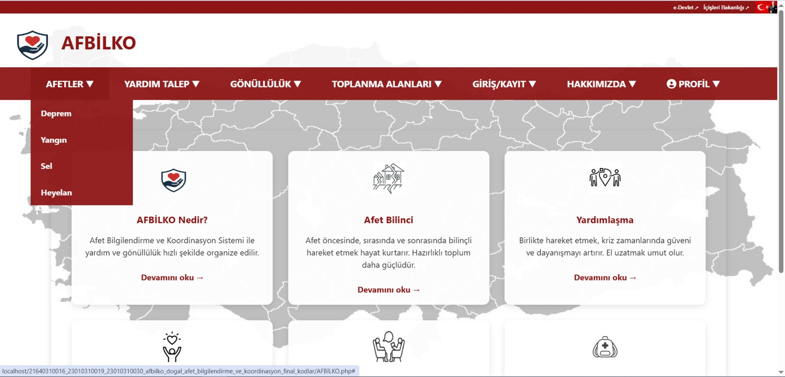</td>
    <td>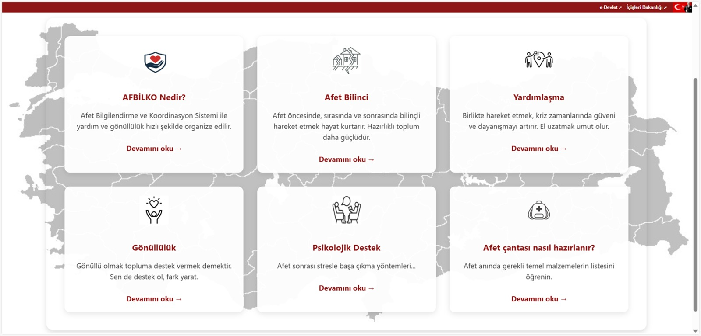</td>
    <td>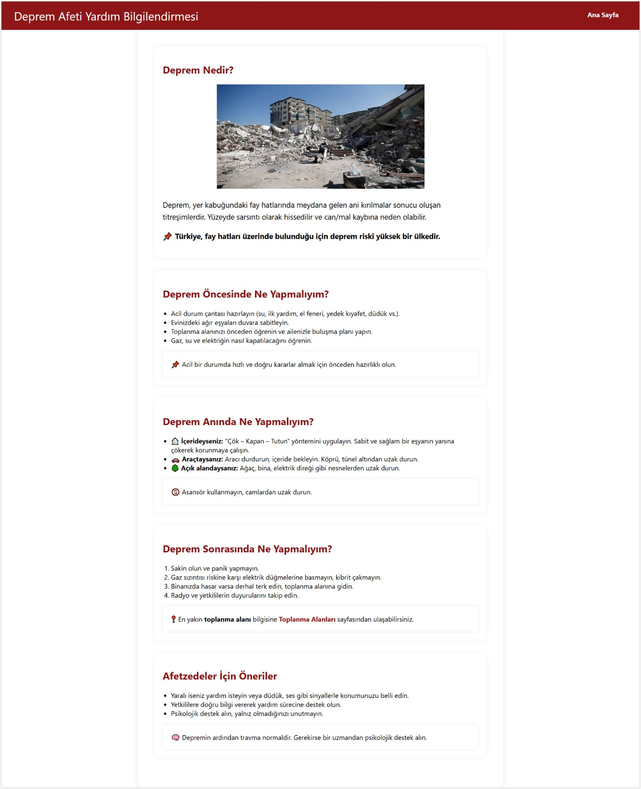</td>
   <td>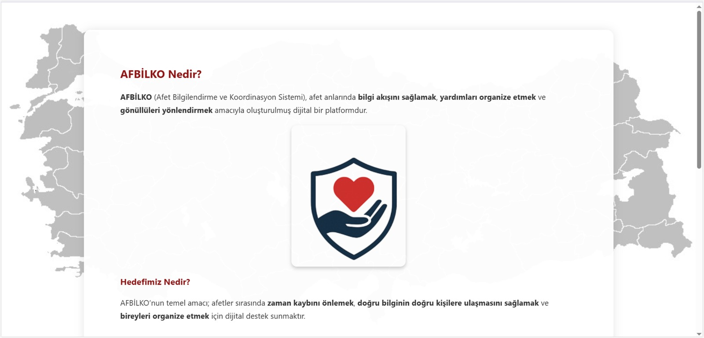</td>
  </tr>
  <tr>
   <td>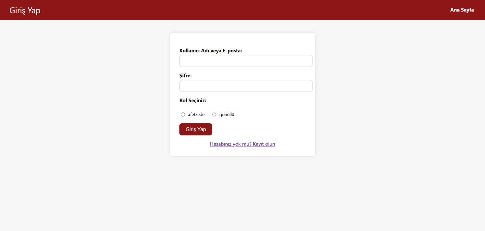</td>
    <td>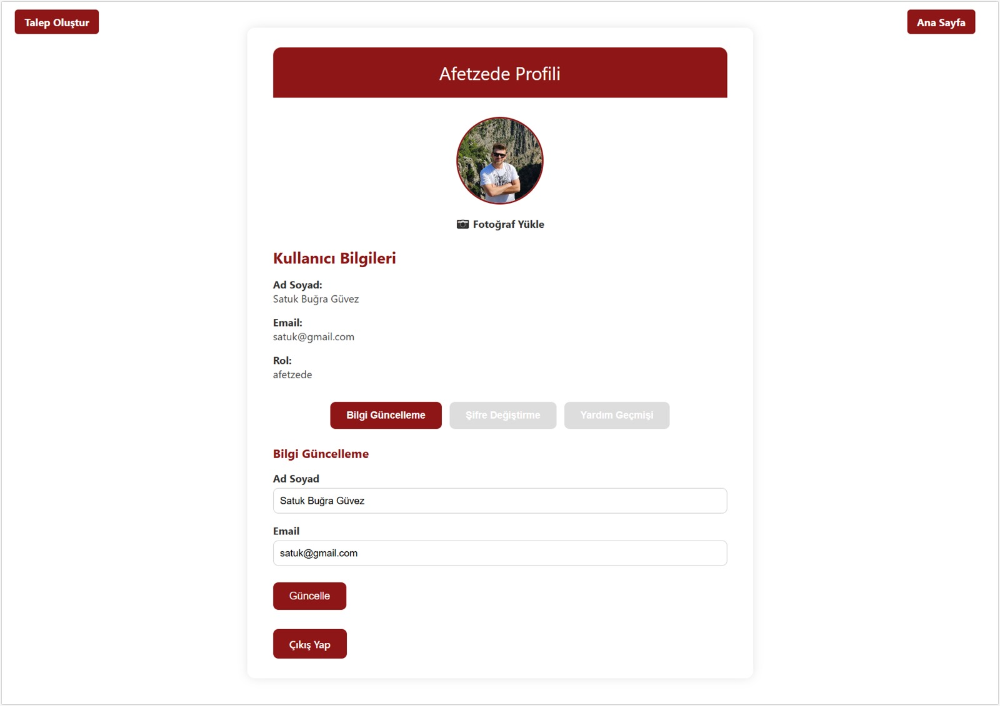</td>
    <td>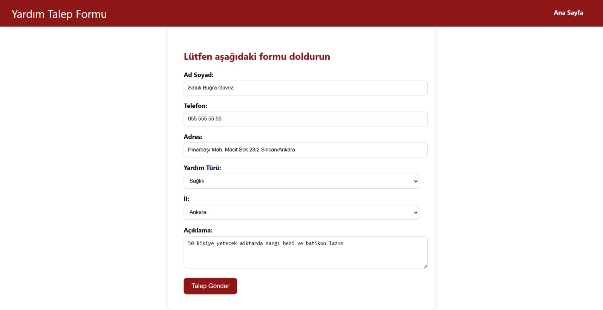</td>
    <td>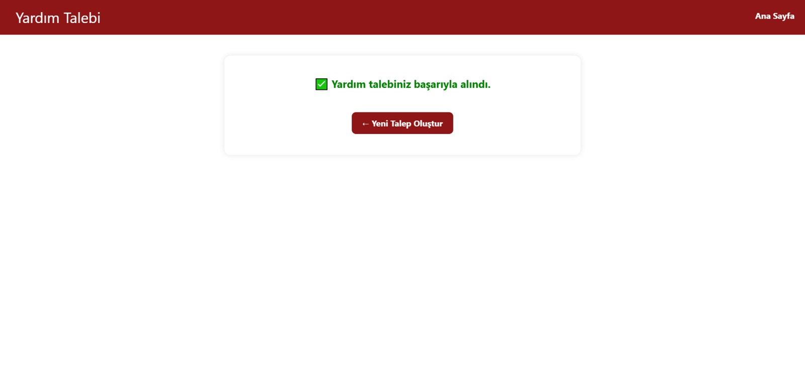</td>
  </tr>
 <tr>
   <td>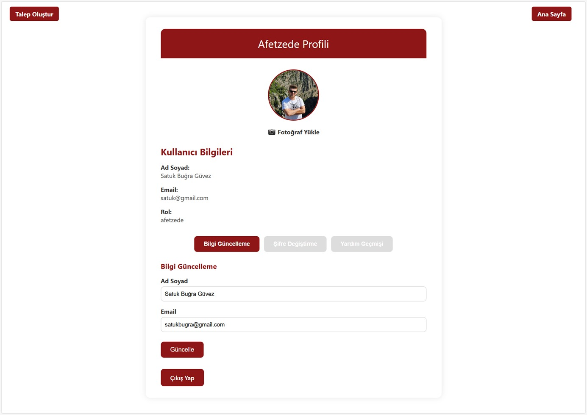</td>
    <td>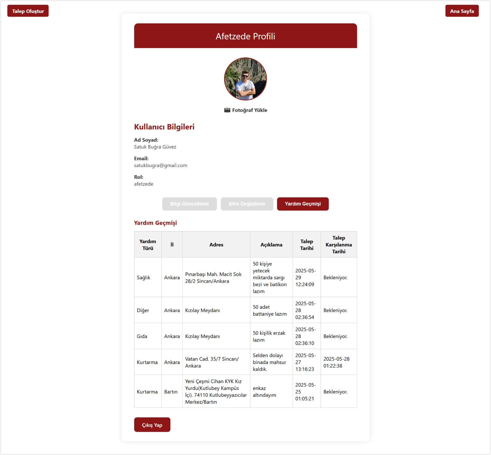</td>
    <td>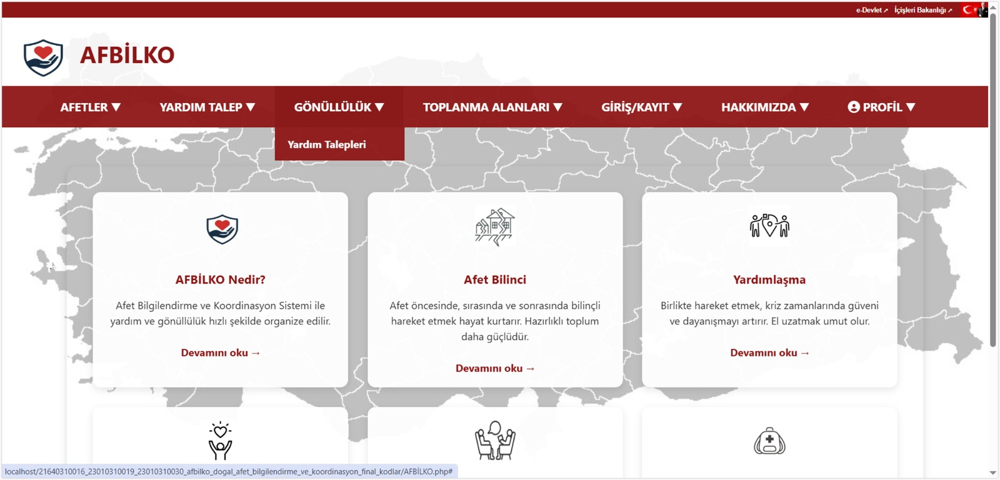</td>
    <td>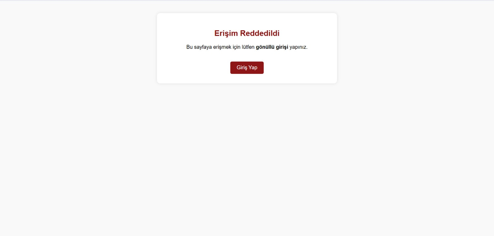</td>
  </tr>
 <tr>
   <td>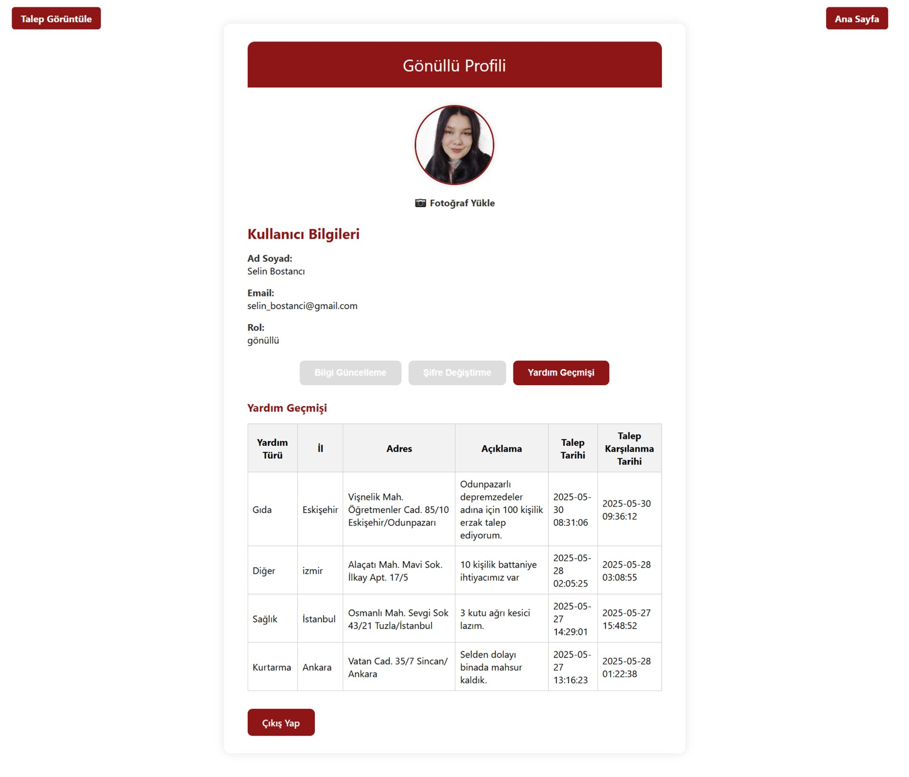</td>
    <td>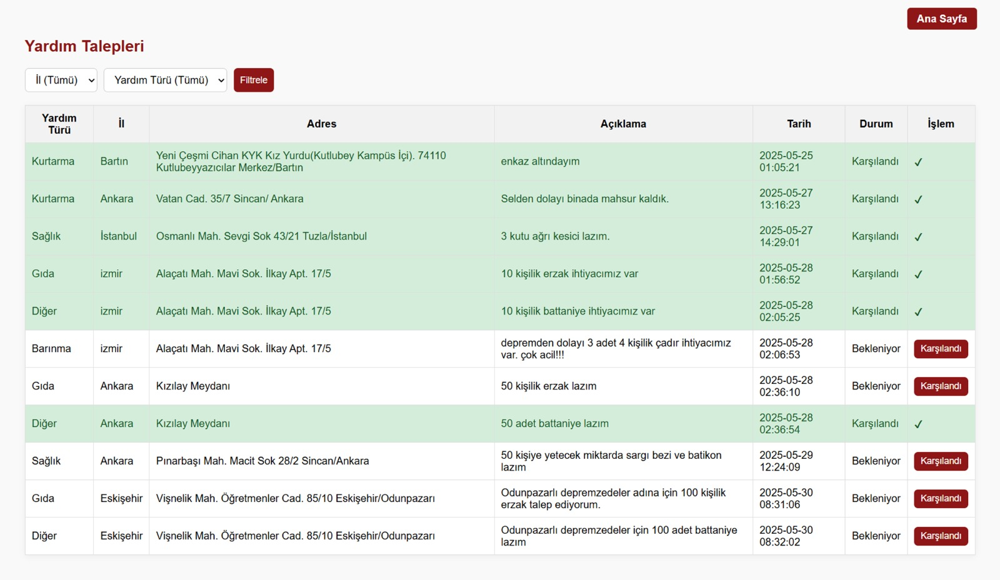</td>
    <td>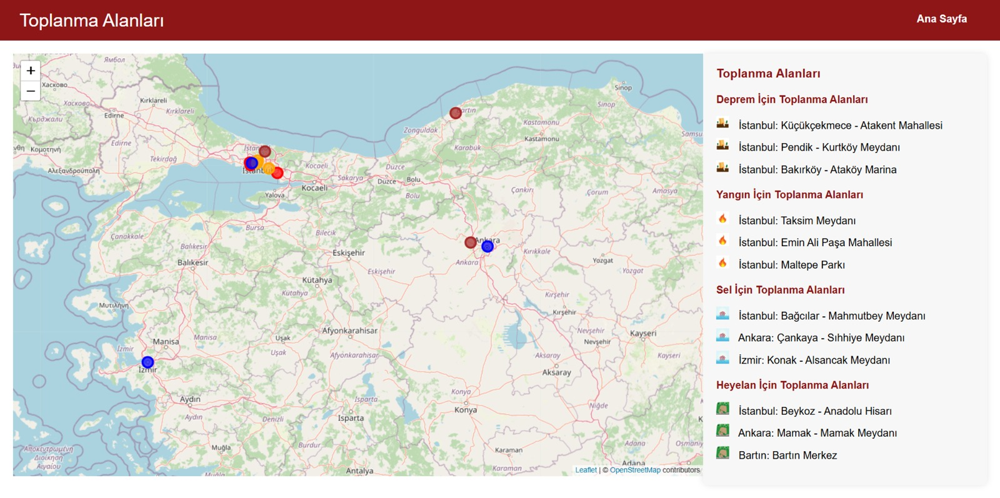</td>
    <td>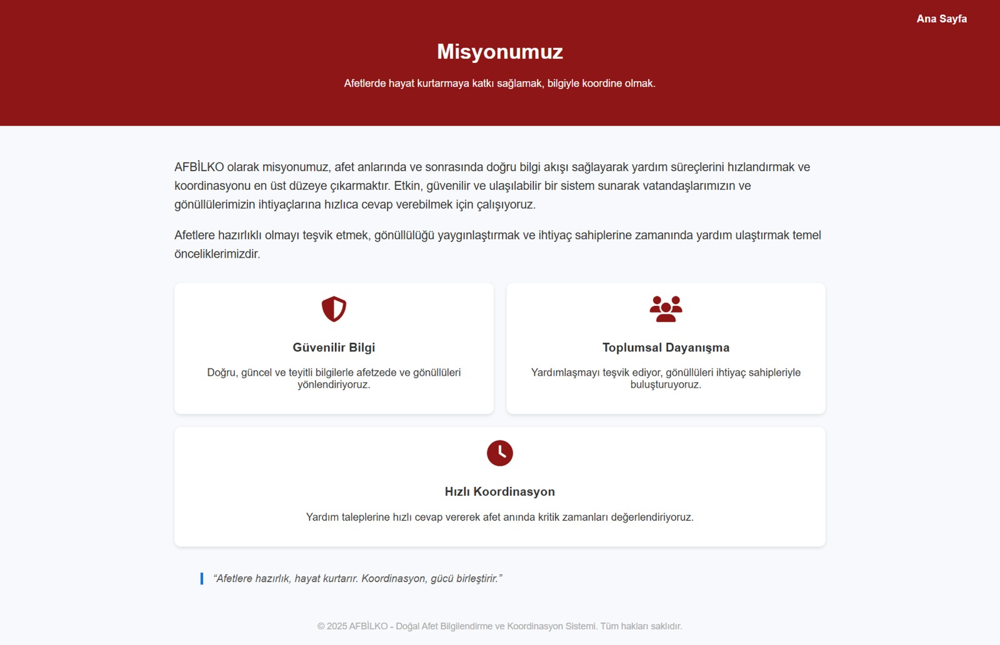</td>
  </tr>
 
</table>
